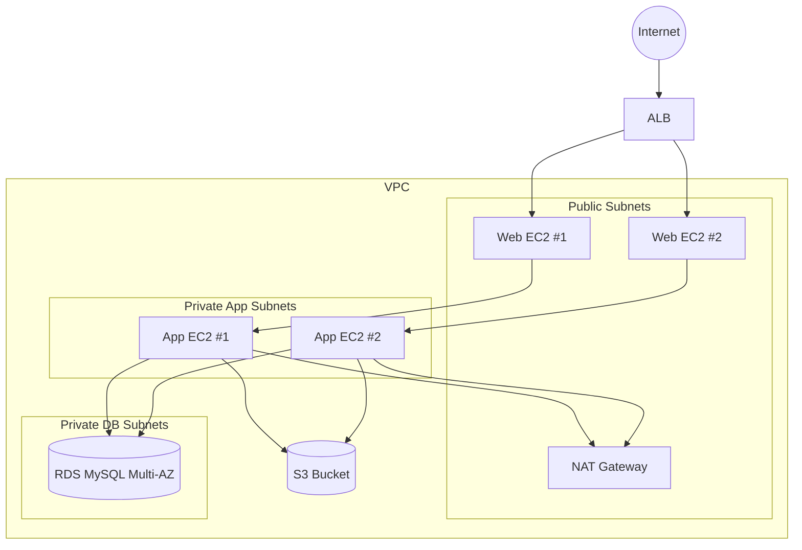

# AWS 3‑Tier Infrastructure Automation (Terraform + Ansible)

Production-style, 3‑tier AWS architecture built with Terraform and optionally configured with Ansible. This project showcases end‑to‑end infrastructure automation: VPC networking, security hardening, load balancing, compute tiers, RDS, and S3 — plus app/web configuration via Ansible.

**Why recruiters care**
- Demonstrates real-world cloud architecture patterns (web/app/db tiers, ALB, private subnets, NAT).
- Uses Infrastructure as Code with clear variables, outputs, and reproducible setup.
- Adds configuration management for the web/app tiers using Ansible playbooks.
- Emphasizes security group scoping and tier isolation.

**Tech stack**
- Terraform `>= 1.0`
- AWS provider `~> 5.0`
- Ansible `2.9+` (optional for post-provisioning)

**What gets provisioned**
- VPC with public and private subnets across two AZs
- Internet Gateway + NAT Gateway
- ALB + target group + listener
- 2 Web EC2 instances (public subnets)
- 2 App EC2 instances (private subnets)
- RDS MySQL (Multi‑AZ) in private DB subnets
- S3 bucket with public access blocked

**Default region**
- `ap-south-1` (change `aws_region` in `variable.tf` or via `terraform.tfvars`)

**Architecture at a glance**
- Public Web Tier: ALB + EC2 web servers
- Private App Tier: EC2 app servers
- Private DB Tier: RDS MySQL (Multi‑AZ)
- Strict security groups between tiers

**Architecture diagram**


**Quick start**
```bash
terraform init
terraform plan
terraform apply
```

If you want Ansible configuration after provisioning:
```bash
terraform output
sed -i 's/<WEB_1>/YOUR_WEB_1_IP/g' ansible/inventory.ini
sed -i 's/<WEB_2>/YOUR_WEB_2_IP/g' ansible/inventory.ini
sed -i 's/<APP_1>/YOUR_APP_1_IP/g' ansible/inventory.ini
sed -i 's/<APP_2>/YOUR_APP_2_IP/g' ansible/inventory.ini
ansible-playbook -i ansible/inventory.ini ansible/playbooks/site.yml
```

**Key outputs**
- `alb_dns_name` to access the web tier
- `web_servers` and `app_servers` instance details
- `rds_endpoint` for database connectivity

**Configuration**
- Sensitive DB creds are marked `sensitive` in `variable.tf`
- Set `db_password` and any overrides via `terraform.tfvars` or `-var`

Example:
```hcl
db_password = "replace-me"
environment = "prod"
```

**Repository structure**
```
main.tf            # Core infrastructure (VPC, subnets, SGs, ALB, EC2, RDS, S3)
provider.tf        # Provider and Terraform versions
variable.tf        # Input variables and defaults
outputs.tf         # Outputs for post-provisioning use
ansible/           # Playbooks and templates for web/app config
```

**Security notes**
- Web tier accepts HTTP/HTTPS from the internet via ALB
- App tier only accepts traffic from web tier SG
- DB tier only accepts MySQL from app tier SG
- S3 bucket has public access blocked

**Cleanup**
```bash
terraform destroy
```

**Suggested improvements**
- Add HTTPS with ACM + ALB listener on 443
- Replace hardcoded AMI ID with data source lookup
- Add autoscaling groups for web/app tiers
- Enable RDS backups and encryption at rest
